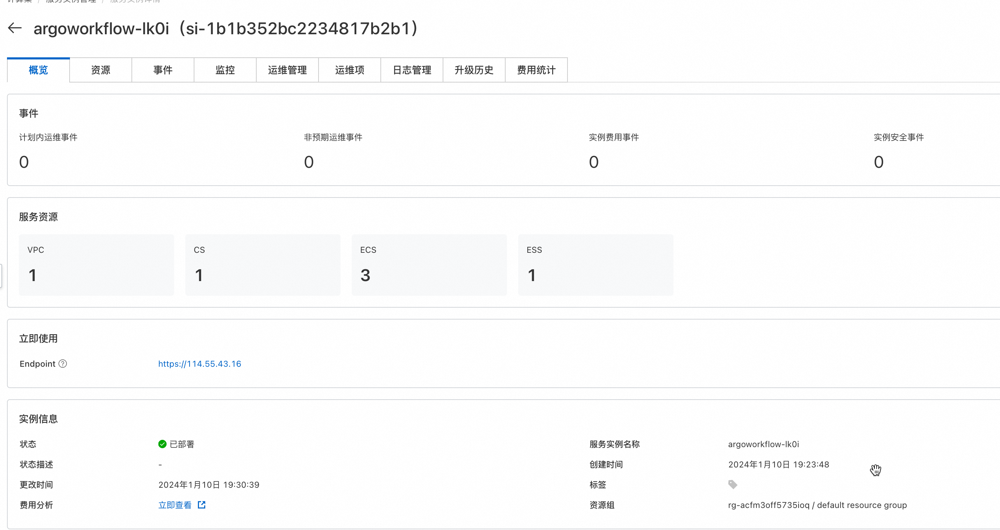
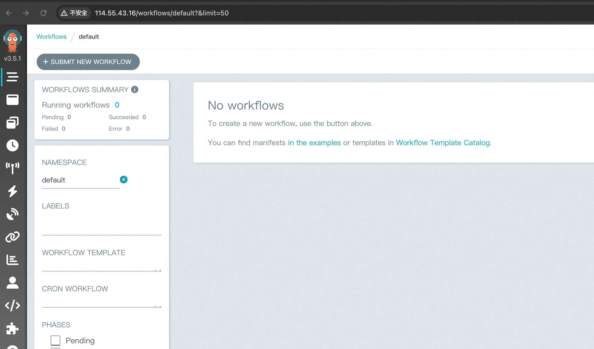

# Argo Workflows服务实例部署文档

## 概述
Argo Workflows是一个开源项目，为Kubernetes提供container-native工作流程，其主要通过Kubernetes CRD实现的。
特点如下：
- 工作流的每一步都是一个容器
- 将多步骤工作流建模为一系列任务，或者使用有向无环图（DAG）描述任务之间的依赖关系
- 可以在短时间内轻松运行用于机器学习或数据处理的计算密集型作业
- 在Kubernetes上运行CI/CD Pipeline，无需复杂的软件配置

本文向您介绍如何开通计算巢上的Argo Workflows服务，以及部署流程和使用说明。

## 计费说明
Argo Workflows为开源社区版，文档参考[官网](https://argoproj.github.io/workflows/) 服务可免费使用。
目前支持两种模式进行部署。

- 已有阿里云ack集群，这种情况下可以直接将服务部署到该集群中，用户不需付费。
- 新建阿里云ack集群，然后部署服务，这种情况下只用支付ack资源本身的费用。
  
Argo Workflows在计算巢上的费用主要涉及：

- 所选vCPU与内存规格
- 磁盘容量
- 公网带宽
- ack集群费用

计费方式包括：

- 按量付费（小时）
- 包年包月

预估费用在创建实例时可实时看到。

## 部署架构
Argo Workflows服务为容器服务，部署在ack集群上。

## RAM账号所需权限
Argo Workflows服务需要对ECS、VPC、ACK等资源进行访问和创建操作，若您使用RAM用户创建服务实例，需要在创建服务实例前，对使用的RAM用户的账号添加相应资源的权限。添加RAM权限的详细操作，请参见[为RAM用户授权](https://help.aliyun.com/document_detail/121945.html)。所需权限如下表所示。

| 权限策略名称 | 备注 |
| --- | --- |
| AliyunECSFullAccess | 管理云服务器服务（ECS）的权限 |
| AliyunVPCFullAccess | 管理专有网络（VPC）的权限 |
| AliyunROSFullAccess | 管理资源编排服务（ROS）的权限 |
| AliyunComputeNestUserFullAccess | 管理计算巢服务（ComputeNest）的用户侧权限 |
| AliyunCloudMonitorFullAccess | 管理云监控（CloudMonitor）的权限 |
| AliyunCSFullAccess | 管理容器服务(CS)的权限 |

## 部署流程

### 部署步骤
单击[部署链接](https://computenest.console.aliyun.com/user/cn-hangzhou/serviceInstanceCreate?ServiceId=service-d1301086237b4a0aa65d)，进入服务实例部署界面，根据界面提示，填写参数完成部署。

### 部署参数说明
您在创建服务实例的过程中，需要配置服务实例信息。下文介绍OpenCost服务实例输入参数的详细信息。
#### 已有ack集群
是否新建ack集群参数选择否时，代表现在已有ack集群，此时需要填写以下参数。

| 参数组       | 参数项       | 示例                              | 说明                           |
|-----------|-----------|---------------------------------|------------------------------|
| 服务实例名称    |           | test                            | 实例的名称                        |
| 地域        |           | 华东1（杭州）                         | 选中服务实例的地域，建议就近选中，以获取更好的网络延时。 |
| 是否新建ack集群 | 是否新建ack集群 | 否                               | 选择否代表已有ack集群，不用新建            |
| 是否新建ack集群 | K8s集群ID   | ccde6deb0f612402786e611a7e1230d | 根据地域选择地域中用户已有的集群id           |

### 部署参数说明
您在创建服务实例的过程中，需要配置服务实例信息。下文介绍Argo Workflows服务实例输入参数的详细信息。
#### 已有ack集群
是否新建ack集群参数选择否时，代表现在已有ack集群，此时需要填写以下参数。

| 参数组       | 参数项       | 示例                              | 说明                           |
|-----------|-----------|---------------------------------|------------------------------|
| 服务实例名称    |           | test                            | 实例的名称                        |
| 地域        |           | 华东1（杭州）                         | 选中服务实例的地域，建议就近选中，以获取更好的网络延时。 |
| 是否新建ack集群 | 是否新建ack集群 | 否                               | 选择否代表已有ack集群，不用新建            |
| 是否新建ack集群 | K8s集群ID   | ccde6deb0f612402786e611a7e1230d | 根据地域选择地域中用户已有的集群id           |

#### 新建ack集群

| 参数组          | 参数项               | 示例            | 说明                                                                                                                                    |
|--------------|-------------------|---------------|---------------------------------------------------------------------------------------------------------------------------------------|
| 服务实例名称       |                   | test          | 实例的名称                                                                                                                                 |
| 地域           |                   | 华东1（杭州）       | 选中服务实例的地域，建议就近选中，以获取更好的网络延时。                                                                                                          |
| 是否新建ack集群    |                   | 是             | 选择是代表新建ack集群                                                                                                                          |
| 付费类型配置       | 付费类型              | 按量付费 或 包年包月   |                                                                                                                                       |
| 基础配置         | 可用区               | 可用区I          | 地域下的不同可用区域                                                                                                                            |
| 基础配置         | 专有网络VPC实例ID       | vpc-xxx       | 选择地域下可用的vpc,不存在可以新建                                                                                                                   |
| 基础配置         | 交换机实例ID           | vsw-xxx       | 选择vpc下的vsw，这个vsw筛选会受上面不同可用区域影响，不存在可以新建                                                                                                |
| 基础配置         | 实例密码              | ********      | 设置实例密码。长度8~30个字符，必须包含三项（大写字母、小写字母、数字、()~!@#$%^&*-+={}[]:;'<>,.?/ 中的特殊符号）                                                              |
| Kubernetes配置 | Worker节点规格        | 	ecs.g6.large | 选择对应cpu核数和内存大小的ecs实例，用作k8s节点                                                                                                          |
| Kubernetes配置 | Worker 系统盘磁盘类型    | ESSD云盘        | 选择k8s集群Worker节点使用的系统盘磁盘类型                                                                                                             |
| Kubernetes配置 | Worker节点系统盘大小(GB) | 120           | 设置Worker节点系统盘大小，单位为GB                                                                                                                 |
| Kubernetes配置 | ack网络插件           | Flannel       | ack集群对应的网络插件，可以选择Flannel或者Terway，网络插件不同，下面设置的pod网络参数不同                                                                                |
| Kubernetes配置 | Pod 网络 CIDR       | 10.0.0.0/16   | ack Pod网络段，网络插件为Flannel时必填，请填写有效的私有网段，即以下网段及其子网：10.0.0.0/8，172.16-31.0.0/12-16，192.168.0.0/16，不能与 VPC 及 VPC 内已有 Kubernetes 集群使用的网段重复。 |
| Kubernetes配置 | pod交换机实例ID        | vsw-xx        | ack Pod交换机实例id，网络插件为Terway时必填，建议选择网段掩码不大于 19 的虚拟交换机                                                                                   |
| Kubernetes配置 | Service CIDR      | 172.16.0.0/16 | ack Service网络段, 可选范围：10.0.0.0/16-24，172.16-31.0.0/16-24，192.168.0.0/16-24,不能与 VPC 及 VPC 内已有 Kubernetes 集群使用的网段重复。                     |

### 验证结果
1.查看服务实例，服务实例创建成功后，部署时间大约需要6分钟。部署完成后，页面上可以看到对应的服务实例。

2.点击详情，可以查看实例详情，对应页面如下：

3.通过实例详情中Endpoint链接，通过返回Admin账号密码，可以访问Argo Workflows服务页面，使用对应的功能

